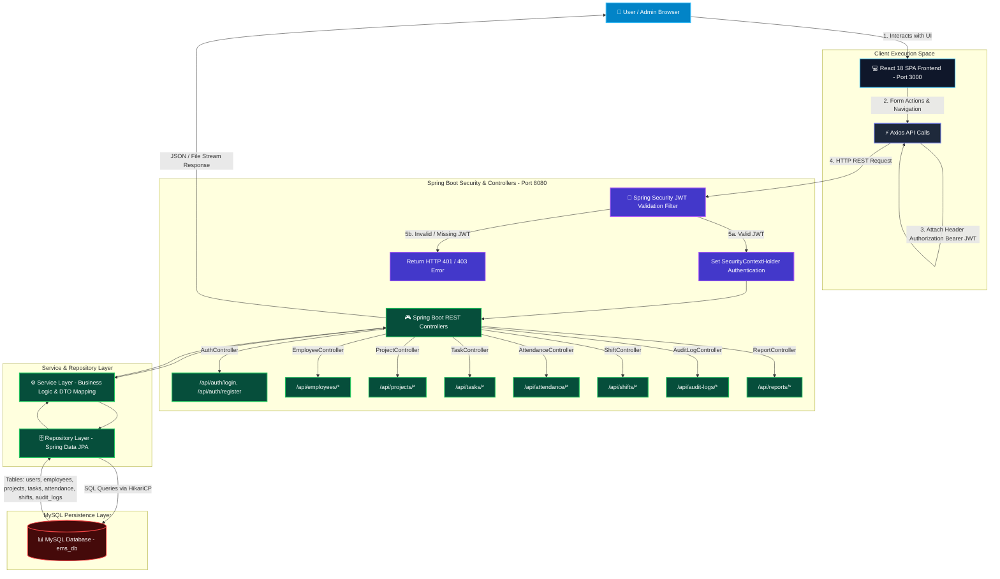

# ⚡ Smart Employee & Project Management System (EMS & PMS)

[](https://www.oracle.com/java/)
[](https://spring.io/projects/spring-boot)
[](https://reactjs.org/)
[](https://mui.com/)
[](https://www.mysql.com/)
[](https://jwt.io/)
[](https://www.docker.com/)
[](LICENSE)

> A production-ready Full Stack Enterprise Application for managing employees, projects, tasks, attendance, shifts, audit logs, and automated reporting with Role-Based Security (`ROLE_ADMIN` & `ROLE_EMPLOYEE`) and dual Light/Dark mode themes.

---

## 📌 Table of Contents
- [📌 Project Overview](#-project-overview)
- [🔄 System Architecture & Flowchart](#-system-architecture--flowchart)
- [✨ Features](#-features)
- [🛠️ Technology Stack](#️-technology-stack)
- [🗄️ Database Setup](#️-database-setup)
- [▶️ How to Run the Project](#-how-to-run-the-project)
- [🐳 Docker Instructions](#-docker-instructions)
- [📷 Screenshots](#-screenshots)
- [🔗 API Documentation](#-api-documentation)
- [🚀 Future Enhancements](#-future-enhancements)
- [👩‍💻 Author Information](#-author-information)

---

## 📌 Project Overview

The **Smart Employee & Project Management System** is an enterprise-grade full-stack web application designed to streamline corporate workforce management, project team allocations, attendance tracking, shift scheduling, system audit trails, and executive report generation.

> [!IMPORTANT]
> **Status**: 100% Completed, Verified & Live on `http://localhost:3000` (React Frontend) and `http://localhost:8080` (Spring Boot REST API).

---

## 🔄 System Architecture & Flowchart



---

## ✨ Features

### 🔐 Security & Role-Based Access Control (RBAC)
* **JWT Token Security**: Stateless session management signed with HMAC-SHA256.
* **BCrypt Hashing**: Password encryption for stored credentials.
* **Role Privileges**:
  * **ADMIN**: Full CRUD permissions on Employees, Projects, Tasks, Shifts, Attendance, Audit Logs, and PDF/Excel Exports.
  * **EMPLOYEE**: Access to personal dashboard, 1-Click Check In/Out, assigned tasks, and status/remarks updates.

### 🎨 Dual Theme System (Light ☀️ & Dark 🌙)
* 1-Click theme toggle in top navbar & login screens.
* **Light Mode**: Crisp `#ffffff` cards and tables, `#f1f5f9` light slate backgrounds, `#0f172a` text, `#cbd5e1` borders.
* **Dark Mode**: Deep `#090d16` background, `#0f172a` cards, `#1e293b` borders, and rich gradient banner cards.

### 👥 Employee Management & Profile Upload
* **Directory Grid**: Sortable headers, search, department filtering, and pagination.
* **Profile Image Upload**: Multipart upload controller storing images in `uploads/` with live avatar preview.

### 📁 Project & Task Management
* **Project Portfolio**: Multi-select employee allocation, priority badges (`LOW`, `MEDIUM`, `HIGH`), and status tracking.
* **Task Tracker**: Progress percentage bars (0-100%), due dates, and status updates (`TODO`, `IN_PROGRESS`, `COMPLETED`).

### ⏱️ Attendance & Shift Management
* **1-Click Check In / Check Out**: Real-time working hours calculation (supports overnight shifts across midnight).
* **Shift Scheduling**: Default seeded shifts (Morning, Afternoon, Night, General) with grace periods and status badges.

### 📊 Reports & Audit Logging
* **System Audit Trail**: Real-time security and data operation logs (`SYSTEM_INIT`, `USER_REGISTER`, `USER_LOGIN`, `CREATE_PROJECT`, `ASSIGN_TASK`, `CHECK_IN`).
* **1-Click Exports**: Download OpenPDF summaries or Apache POI `.xlsx` datasets for tasks, projects, and attendance.

---

## 🛠️ Technology Stack

| Layer | Technology / Library | Description |
|---|---|---|
| **Frontend** | React 18, React Router v6 | Single Page Application architecture |
| **Styling & UI** | Material UI (MUI v5), Bootstrap Icons | Responsive glassmorphic UI |
| **HTTP Client** | Axios | Configured with Bearer Token interceptors |
| **Backend** | Java 17+, Spring Boot 4.0.7 | RESTful microservice architecture |
| **Security** | Spring Security 7, JJWT 0.12.6 | Stateless JWT Authentication & RBAC |
| **Database** | MySQL 8.0, Spring Data JPA | Relational ORM with HikariCP Pooling |
| **Exports** | OpenPDF 2.0, Apache POI 5.3 | Automated PDF & Excel document generation |
| **API Docs** | Springdoc OpenAPI 2.8, Swagger UI | Interactive API documentation |
| **Containers** | Docker, Docker Compose | Multi-container environment isolation |

---

## 🗄️ Database Setup

1. Open MySQL Command Line or Workbench:
```sql
CREATE DATABASE IF NOT EXISTS ems_db;
```
2. Import the database schema from `schema.sql`:
```powershell
mysql -u root -p ems_db < schema.sql
```

---

## ▶️ How to Run the Project

### 1. Backend Setup (Spring Boot)

Config Credentials (`src/main/resources/application.properties`):
* **Database URL**: `jdbc:mysql://localhost:3306/ems_db`
* **Username**: `root` | **Password**: `Harini@123`

Run Backend Server:
```powershell
.\mvnw.cmd spring-boot:run
```
* **Backend API Base**: `http://localhost:8080`
* **Swagger UI API Docs**: `http://localhost:8080/swagger-ui.html`

### 2. Frontend Setup (ReactJS)

```powershell
# Navigate to frontend directory
cd frontend

# Install Node dependencies
npm install

# Start React Dev Server
npm start
```
* **React Web App URL**: `http://localhost:3000`

---

## 🐳 Docker Instructions

Run the complete application stack (MySQL + Backend + Frontend) using Docker Compose:

```powershell
# Build and run containers in detached mode
docker-compose up --build -d
```

### Access Services:
* **Frontend Web App**: `http://localhost:3000`
* **Backend REST API**: `http://localhost:8080/api`
* **Swagger Documentation**: `http://localhost:8080/swagger-ui.html`

### Stop Containers:
```powershell
docker-compose down
```

---

## 📷 Screenshots

* **Dashboard & Telemetry**: Full workforce overview, task milestone progress, and interactive telemetry charts.
* **Employee Directory**: Paginated employee table with search, profile picture upload, and department filters.
* **Attendance & Shifts**: 1-Click Check In/Out, working hours, overtime badges, and shift schedule cards.
* **System Audit Logs**: Real-time event auditing and user activity tracking.

---

## 🔗 API Documentation

Available live at **[http://localhost:8080/swagger-ui.html](http://localhost:8080/swagger-ui.html)**.

| Endpoint | Method | Description | Role Required |
|---|---|---|---|
| `/api/auth/register` | `POST` | Register a new user | Public |
| `/api/auth/login` | `POST` | Authenticate & acquire JWT Token | Public |
| `/api/auth/me` | `GET` | Get currently logged-in user profile | Authenticated |
| `/api/employees` | `GET` | Get all employees | Authenticated |
| `/api/employees` | `POST` | Create employee | `ROLE_ADMIN` |
| `/api/employees/{id}` | `PUT` | Update employee details | `ROLE_ADMIN` / `ROLE_EMPLOYEE` |
| `/api/upload/profile-image` | `POST` | Upload employee profile picture | Authenticated |
| `/api/projects` | `GET` | Get all projects | Authenticated |
| `/api/projects` | `POST` | Create project | `ROLE_ADMIN` |
| `/api/projects/{id}/assign` | `POST` | Assign employees (Many-to-Many) | `ROLE_ADMIN` |
| `/api/tasks` | `GET` | Get all tasks | Authenticated |
| `/api/tasks` | `POST` | Create & assign task | `ROLE_ADMIN` |
| `/api/tasks/{id}/status` | `PATCH` | Update task status & remarks | Authenticated |
| `/api/attendance/check-in` | `POST` | 1-Click employee check-in | Authenticated |
| `/api/attendance/check-out/{id}` | `POST` | Employee check-out | Authenticated |
| `/api/shifts` | `GET` | Get all work shifts | Authenticated |
| `/api/audit-logs` | `GET` | Get system audit trail logs | Authenticated |
| `/api/reports/tasks/pdf` | `GET` | Download PDF Task Summary | Authenticated |
| `/api/reports/tasks/excel` | `GET` | Download Excel `.xlsx` Dataset | Authenticated |

---

## 🚀 Future Enhancements

- [ ] WebSockets integration for real-time live notification alerts.
- [ ] Redis Caching for employee search query optimization.
- [ ] Biometric Integration support for automated attendance clock-in.

---

## 👩‍💻 Author Information

* **Developer**: **Harini Maliga**
* **Role**: Java Full Stack Developer
* **Project**: Smart Employee & Project Management System
* **Repository**: [employee-management-system](https://github.com/Harinimaliga/employee-management-system)
* **Date**: July 2026
