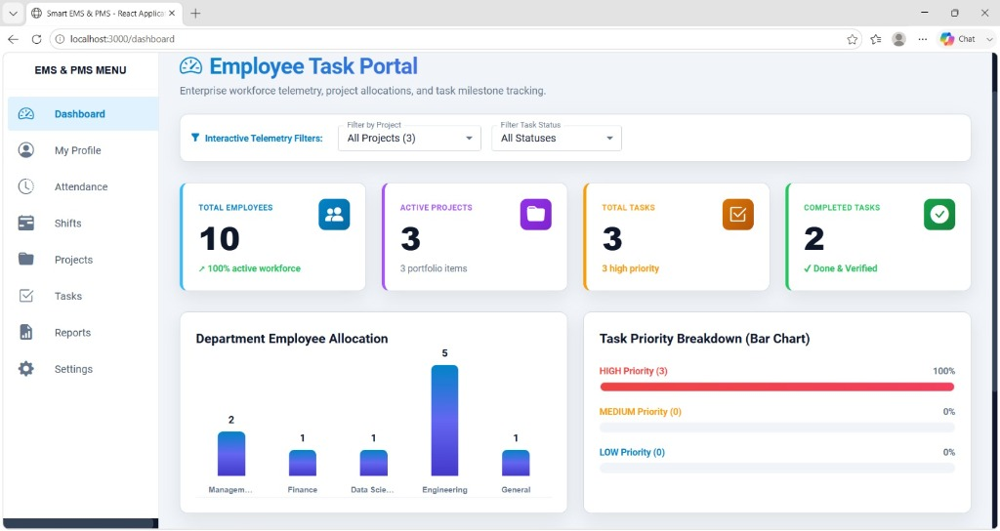
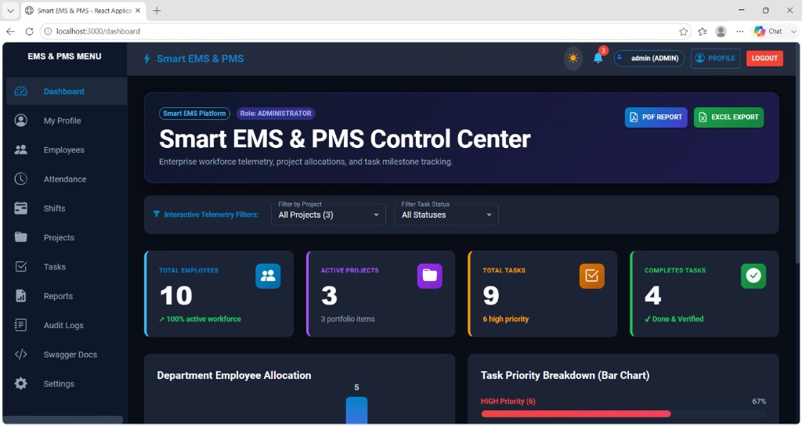
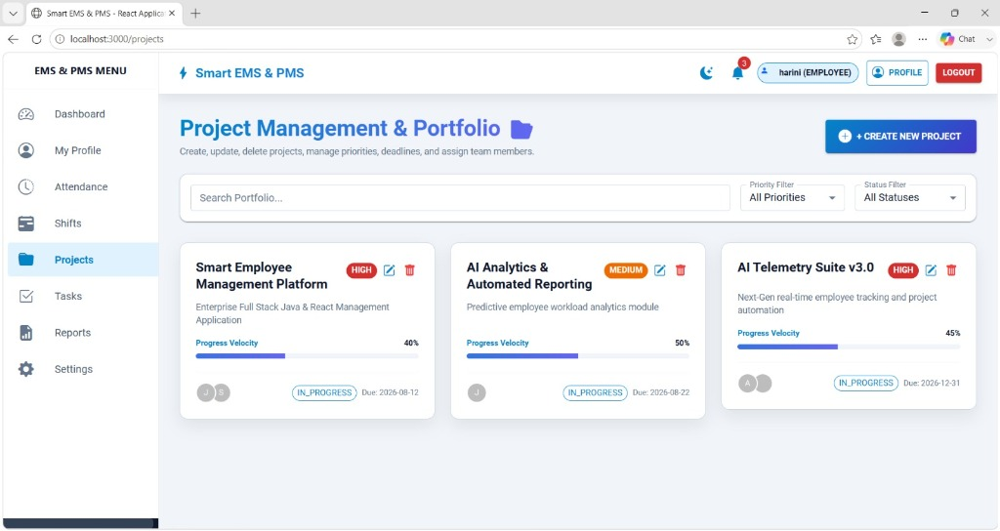
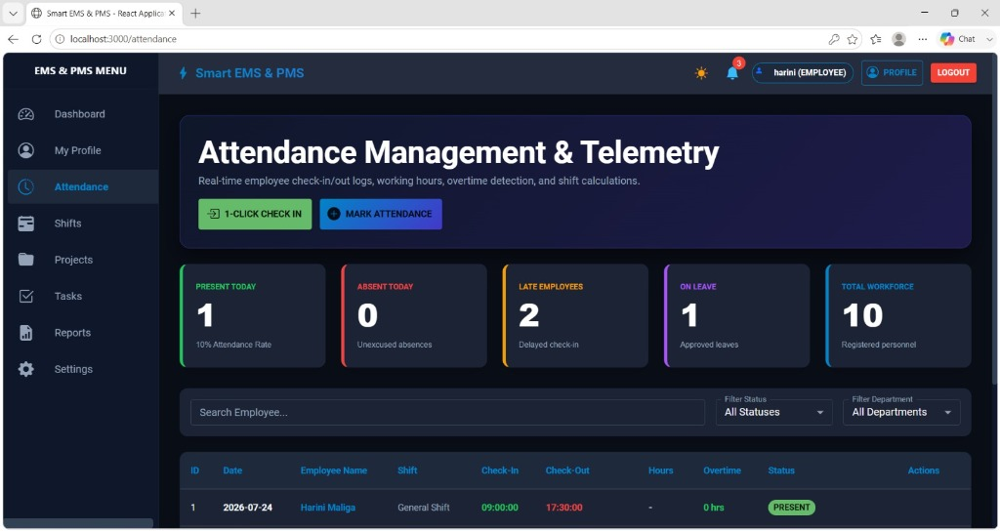
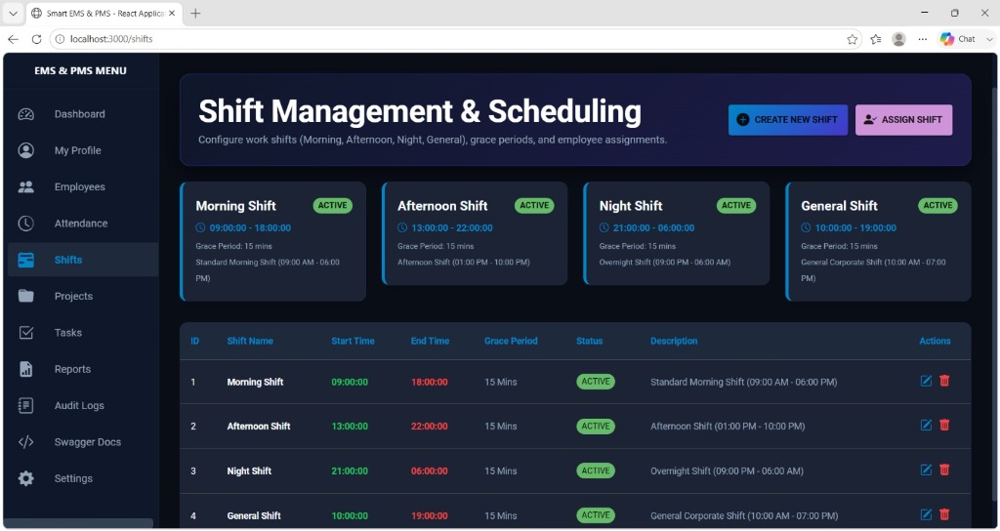
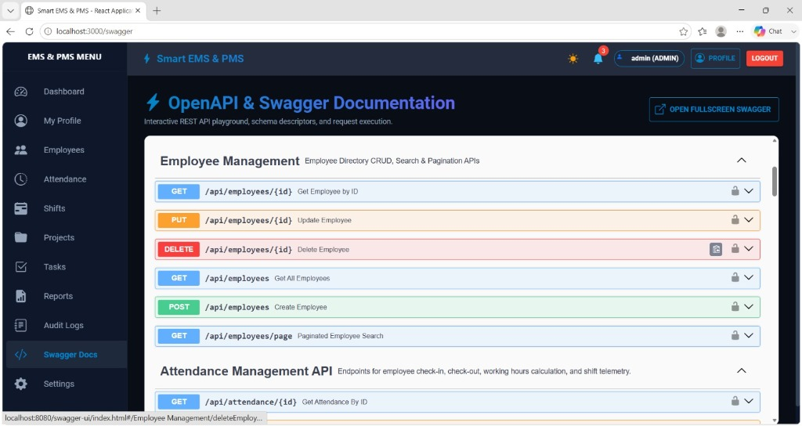
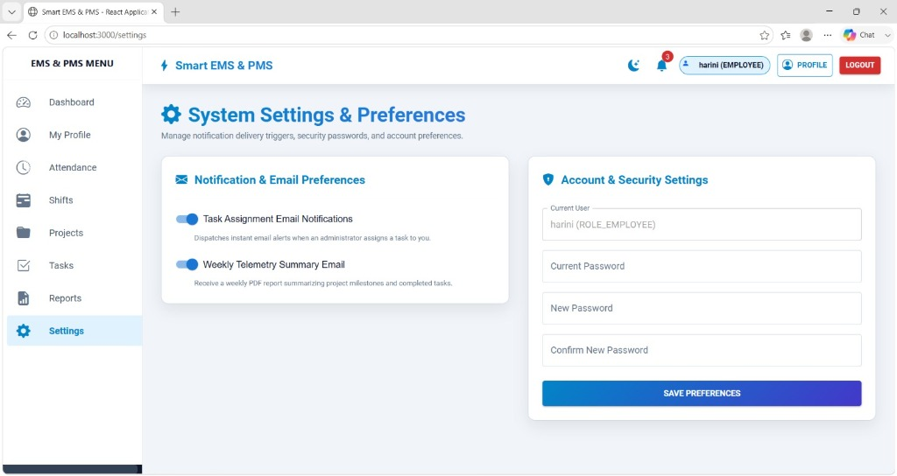
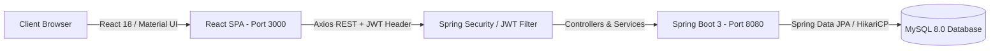

# Smart Employee & Project Management System (EMS & PMS)

[](https://www.oracle.com/java/)
[](https://spring.io/projects/spring-boot)
[](https://reactjs.org/)
[](https://mui.com/)
[](https://www.mysql.com/)
[](https://www.docker.com/)

A full-stack web application built to handle employee directory management, project allocations, task progress tracking, attendance check-ins, work shift scheduling, and automated PDF/Excel reporting.

---

## 📷 Screenshots

### ☀️ Light Mode Dashboard & Telemetry


### 🌙 Dark Mode Dashboard & Control Center


### 📁 Project Management & Portfolio


### ⏱️ Attendance Management & Telemetry


### ⏰ Shift Scheduling & Management


### ⚡ Interactive Swagger API Documentation


### ⚙️ System Settings & Preferences


---

## 💻 System Architecture



---

## 📁 Project Directory Structure

```text
employee-management-system/
├── frontend/                     # React 18 Single Page Application
│   ├── public/                   # Static assets & HTML template
│   ├── src/
│   │   ├── components/           # Navbar, Sidebar, PrivateRoute, Telemetry Charts
│   │   ├── context/              # AuthContext & ThemeContext (Light/Dark Mode)
│   │   ├── hooks/                # Custom React authentication hooks
│   │   ├── pages/                # Dashboard, Profile, Employees, Attendance, Shifts, Projects, Tasks, Reports, AuditLogs
│   │   ├── services/             # Axios API client instance & JWT interceptors
│   │   └── utils/                # Constants & helpers
│   ├── Dockerfile                # Nginx multi-stage build Dockerfile
│   └── package.json              # Frontend dependencies
├── src/                          # Spring Boot Java Backend
│   ├── main/
│   │   ├── java/com/company/ems/
│   │   │   ├── config/           # DataInitializer, WebMvc, Security, OpenApi
│   │   │   ├── controller/       # Auth, Employee, Project, Task, Attendance, Shift, Audit, Report, Upload
│   │   │   ├── dto/              # Data Transfer Objects & Requests
│   │   │   ├── entity/           # JPA Entities (User, Employee, Project, Task, Attendance, Shift, AuditLog)
│   │   │   ├── exception/        # Global Exception Handler
│   │   │   ├── repository/       # Spring Data JPA Repositories
│   │   │   ├── security/         # JWT Provider, Auth Filter, UserDetailsService
│   │   │   └── service/          # Core Business Logic & OpenPDF/Apache POI Generators
│   │   └── resources/
│   │       ├── application.properties
│   │       ├── application-dev.properties
│   │       ├── application-prod.properties
│   │       └── application-test.properties
│   └── test/                     # JUnit 5 & Mockito Unit Test Suite
├── screenshots/                  # Application UI Screenshots
│   ├── dashboard-light.jpg
│   ├── dashboard-dark.jpg
│   ├── projects-portfolio.jpg
│   ├── attendance.jpg
│   ├── shifts.jpg
│   ├── swagger.jpg
│   └── settings.jpg
├── Dockerfile                    # Spring Boot JDK multi-stage Dockerfile
├── docker-compose.yml            # Multi-container orchestration (MySQL + Backend + Frontend)
├── pom.xml                       # Maven build configuration
├── schema.sql                    # MySQL Database DDL script
└── README.md                     # Project documentation
```

---

## ⚡ Key Features

* **Authentication & Role Security**: Stateless JWT authentication with distinct `ADMIN` and `EMPLOYEE` role privileges.
* **User Profile & Avatar Upload**: Disk-backed profile photo uploads with live avatar preview.
* **Employee Management**: Filterable directory grid with search, department allocation, and CRUD actions.
* **Project & Team Allocation**: Multi-employee team assignments per project with priority badges (`HIGH`, `MEDIUM`, `LOW`) and deadline tracking.
* **Task Tracker**: Progress percentage sliders (0–100%), status updates (`TODO`, `IN_PROGRESS`, `COMPLETED`), and comments.
* **Attendance & Shifts**: 1-Click daily check-in/out, automatic working hours & overtime calculation, and default shift presets.
* **Audit Trail & Event Logs**: System activity auditing for user logins, task assignments, and record updates.
* **1-Click Export Reports**: Download PDF summaries (OpenPDF) or Excel `.xlsx` datasets (Apache POI).
* **Dual Light & Dark Themes**: Interactive theme toggle button in top navigation bar.

---

## 🛠 Tech Stack

| Component | Technology |
|---|---|
| **Frontend** | React 18, Material UI (MUI v5), Bootstrap Icons, Axios |
| **Backend** | Java 17, Spring Boot 3, Spring Security, Spring Data JPA |
| **Database** | MySQL 8.0 |
| **Security** | JJWT (JSON Web Token), BCrypt |
| **Reporting** | OpenPDF, Apache POI |
| **DevOps** | Docker, Docker Compose, Maven |

---

## 🚀 Quick Start Guide

### Prerequisites
* Java 17 or higher
* Node.js 18+ & npm
* MySQL 8.0 running locally on port 3306

### 1. Database Setup
Create the MySQL database named `ems_db`:
```sql
CREATE DATABASE ems_db;
```
Import `schema.sql`:
```bash
mysql -u root -p ems_db < schema.sql
```

### 2. Run Backend (Spring Boot)
Update database credentials in `src/main/resources/application.properties` if needed:
```properties
spring.datasource.url=jdbc:mysql://localhost:3306/ems_db?allowPublicKeyRetrieval=true&useSSL=false
spring.datasource.username=root
spring.datasource.password=Harini@123
```
Run the application:
```bash
./mvnw spring-boot:run
```
* **API Base URL**: `http://localhost:8080/api`
* **Swagger API Docs**: `http://localhost:8080/swagger-ui.html`

### 3. Run Frontend (React)
```bash
cd frontend
npm install
npm start
```
* **Web App URL**: `http://localhost:3000`

---

## 🐳 Docker Deployment

Run the entire application (MySQL + Spring Boot + React) with Docker Compose:

```bash
docker-compose up --build -d
```
To stop the containers:
```bash
docker-compose down
```

---

## 🔑 Demo Credentials

| Role | Username | Password |
|---|---|---|
| **Admin** | `admin` | `admin123` |
| **Employee** | `harini` | `password123` |

---

## 🔗 Key API Endpoints

| Method | Endpoint | Description | Role |
|---|---|---|---|
| `POST` | `/api/auth/login` | Authenticate & get JWT token | Public |
| `POST` | `/api/auth/register` | Register new user | Public |
| `GET` | `/api/employees` | Get employee list | Authenticated |
| `POST` | `/api/employees` | Create employee | Admin |
| `POST` | `/api/upload/profile-image` | Upload profile avatar | Authenticated |
| `GET` | `/api/projects` | Get all projects | Authenticated |
| `POST` | `/api/projects/{id}/assign` | Assign employees to project | Admin |
| `PATCH` | `/api/tasks/{id}/status` | Update task progress & status | Authenticated |
| `POST` | `/api/attendance/check-in` | 1-Click attendance check-in | Authenticated |
| `GET` | `/api/reports/tasks/pdf` | Export tasks PDF report | Authenticated |
| `GET` | `/api/reports/tasks/excel` | Export tasks Excel dataset | Authenticated |

---

## 👩‍💻 Author

* **Harini Maliga** - *Java Full Stack Developer*
* GitHub: [@Harinimaliga](https://github.com/Harinimaliga)
